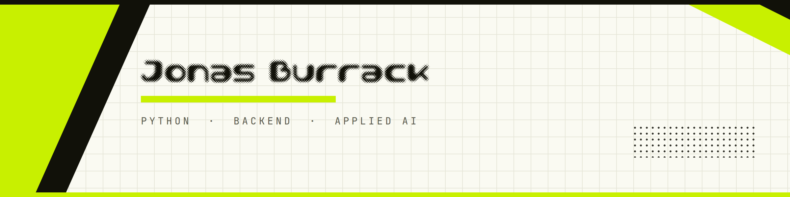

<p align="center">
  
</p>

<p align="center">
  
  
  
  
</p>

```
┌─ SYSTEM ────────────────────────────────────────────────────┐
│  operator   Jonas Burrack                                   │
│  location   Berlin, DE                                      │
│  role       Python developer · backend · applied AI         │
│  status     open to work                                    │
│  running    JobRadar v2.5   [ uptime: nominal ]             │
│  learning   cloud fundamentals · k8s basics                 │
└─────────────────────────────────────────────────────────────┘
```

I build practical software: Python backends, API integrations, automation
workflows and LLM pipelines that run unattended and don't need babysitting.
I use AI developer tooling daily as part of how I ship, not as a novelty.

---

### ▚ Stack

**Backend**


**Frontend**


**Automation & AI**


**Delivery**


---

### ▚ Selected work

**◤ JobRadar** &nbsp;·&nbsp; multi-step LLM pipeline, self-hosted and operated

Scrapes job sources, dedupes against a datastore, scores every listing with an
LLM using structured JSON, and writes results to a synced store. Orchestrated in
n8n inside a Podman container, running unattended on a schedule.
Built request batching and retry policy after hitting real upstream rate limits,
and fixed a DNS resolution fault that was killing outbound calls in production.

`Python` `n8n` `LLM` `structured output` `Podman` `Google Sheets API`

**◤ Liquidity Radar** &nbsp;·&nbsp; [github.com/NJBurrack/liquidity-radar](https://github.com/NJBurrack/liquidity-radar)

Full-stack market intelligence dashboard. FastAPI backend, Streamlit interface,
PostgreSQL persistence, documented REST endpoints, the whole thing containerised
with Docker Compose so it comes up reproducibly.

`FastAPI` `Streamlit` `PostgreSQL` `Docker Compose` `Swagger`

**◤ Jobbi** &nbsp;·&nbsp; SaaS web app + Chrome extension, built in a team

Vue 3 frontend, Django and DRF REST API, analytics dashboard and a Manifest V3
browser extension, shipped as one product across three services. I owned
authentication and access management end to end, plus the CI pipeline.

`Vue 3` `Django/DRF` `JWT` `Google OAuth` `GitHub Actions` `PostgreSQL`

---

### ▚ Currently

- Cloud fundamentals, working toward a certification
- Kubernetes basics, building on the Docker and Podman side I already run
- Pushing JobRadar further: more sources, better scoring, less noise

---

### ▚ Contact

[](mailto:njburrack@outlook.com)
[](https://de.linkedin.com/in/njburrack)

<br>

<p align="center">
  
  
</p>

<p align="center">
  <sub><code>build log / 2026</code></sub>
</p>
